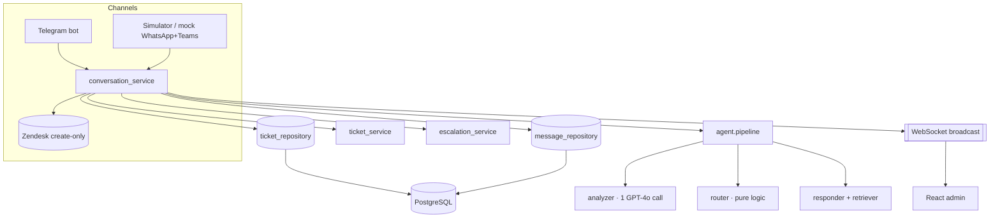

# ai-helpdesk-agent

Multichannel AI support agent for the Gatum SMS/SMPP platform. Connects to Telegram and
Zendesk (real), mocks WhatsApp/Teams through an in-app simulator, handles 8 support
scenarios, records a structured ticket per conversation, escalates to the right specialist,
and reports analytics. Ships with a React admin panel.

## Prerequisites
- Docker + Docker Compose
- (Optional, for local dev) `uv` and Node.js 20+
- An OpenAI API key (for live AI replies; the app still runs without one — replies fall back
  to deterministic templates)
- (Optional) A Telegram bot token and a Zendesk trial account

## One-command run
```bash
cp .env.example .env        # then fill in OPENAI_API_KEY (and optionally Telegram/Zendesk)
make run                    # docker compose up --build
```
Open http://localhost:8000 — the admin panel, REST API, WebSocket, and (if a token is set)
the in-process Telegram bot all run in the single `app` container. PostgreSQL runs as the
`db` container with a persistent named volume.

- Analytics from the CLI: `make report`
- Load demo tickets: `make seed`
- Run unit tests (host): `make test`

### Getting a Telegram token
Message [@BotFather](https://t.me/BotFather), `/newbot`, copy the token into
`TELEGRAM_BOT_TOKEN`. Long-polling is used, so no public URL/tunnel is needed.

### Zendesk trial setup
Create a free Zendesk trial. In Admin Center → Apps and integrations → APIs → Zendesk API,
enable token access and create an API token. Set `ZENDESK_SUBDOMAIN` (the `xxx` in
`xxx.zendesk.com`), `ZENDESK_EMAIL`, and `ZENDESK_API_TOKEN`. If unset, Zendesk is treated as
unavailable (logged warning, no crash).

### Local dev (no Docker)
```bash
cd backend && uv sync && uv run uvicorn app.main:app --port 8000
cd frontend && npm install && npm run dev    # :5173 with proxy to :8000
```

## Architecture



Layered (onion) dependency flow: `models → repositories → schemas → services → routers`, with
side modules `agent/` (pure, no DB), `channels/` (infra adapters), `knowledge/` (retriever),
and `utils/` (generic repository, exceptions, WebSocket manager, timestamp mixin). The
`agent.router` is a pure function and is the most heavily unit-tested unit.

## Architecture Decision Records (ADR)

- **FastAPI** — async-first, matches the WebSocket + Telegram polling workload and gives typed
  request/response models for free.
- **uv** — fast, reproducible installs via `uv.lock`; one tool for venv + deps; used locally
  and in the Dockerfile (`uv sync --frozen`).
- **PostgreSQL (asyncpg) + SQLAlchemy async as primary store** — closest to a real production
  deployment, native `jsonb` for the ticket `metadata`, proper concurrency for live WS/Telegram
  traffic, runs as a compose service with a persistent volume. The engine is built from a single
  `DATABASE_URL`, so unit tests fall back to in-memory SQLite (aiosqlite) for fast, dependency-free
  CI. The only dialect-sensitive surfaces — the JSON column and string UUIDs — are portable across
  both.
- **Async SQLAlchemy** — consistent with async FastAPI + Telegram polling; no sync/async bridging.
- **Single merged analyzer + pure router** (over multi-agent) — one structured GPT-4o call does
  classification + entity extraction + sentiment, cutting latency and cost; routing is deterministic
  pure logic, fully unit-testable and free.
- **OpenAI structured outputs behind our own `LLMProvider`** (over an agent framework like pydantic-ai)
  — the analyzer parses straight into a validated pydantic `AnalysisResult` via the native
  structured-outputs API (`beta.chat.completions.parse`), eliminating manual JSON/enum coercion. We keep
  our own thin `LLMProvider` ABC rather than adopting an agent framework: it satisfies the spec's
  provider-abstraction requirement, keeps the dependency surface small, and leaves the routing logic in
  our own testable pure function instead of a framework's control flow. Domain carriers that are built by
  our own code (`RouterDecision`, `AgentResult`, `AppContext`) stay dataclasses — pydantic adds value only
  at the LLM boundary where untrusted data enters.
- **Layered (onion) architecture** — strict one-directional dependencies keep services unit-testable
  (inject a mock repository) and routes trivial.
- **Keyword retriever** — sufficient for the prototype FAQ; the `Retriever` ABC allows a drop-in
  vector store (Chroma/FAISS) with no agent changes.
- **Mock WhatsApp/Teams** — Business/Teams approval takes time; the simulator exercises every
  scenario through the same pipeline. Telegram + Zendesk satisfy the two-real-channel requirement.
- **After-hours modeling** — `after_hours` is its own category for non-urgent messages outside
  09:00–18:00 (Mon–Fri); urgent outage (C-6) still escalates immediately at night. A `was_after_hours`
  flag is stored in metadata for analytics regardless of final category.
- **Telegram in-process (not a separate worker)** — the polling loop runs in the FastAPI lifespan,
  sharing the pipeline and WebSocket broadcaster in-memory; no broker needed. Extracting it into its
  own container is the documented scaling path, not needed now.
- **`general_support` escalation target** — extends the assignment's enum so C-7 routes to a non-null
  target, keeping the `resolved_by_ai` invariant clean (C-7 reads as escalated, not AI-resolved).
- **C-6 priority = `urgent`** (not the literal "high") — the scenario demands "escalate immediately"
  and "confirm urgency"; `high` is reserved for C-8.
- **fastapi-pagination** — ready-made `Page[T]` + SQLAlchemy integration keeps list/history endpoints
  uniform; the repository owns `paginate` with a transformer mapping ORM rows → Read schemas.
- **loguru** — zero-boilerplate structured logging over stdlib `logging`; one configured sink.
- **Error model** — expected business failures raise `BusinessError` (mapped to JSON by a registered
  handler); unexpected ones are caught/logged with full context by the `catch_errors` decorator.
- **Backend layout** — `config/` package, `routers/api.py` aggregator, `utils/` generic repository +
  WebSocket manager, `create_app()` factory — follows the team's established conventions.
- **Testing strategy** — the deterministic core is unit-tested (`test_router.py`,
  `test_analytics_service.py`, `test_ticket_repository.py`, plus `test_conversation_service.py`,
  `test_ticket_service.py`, `test_retriever.py`); the non-deterministic LLM pipeline is exercised
  manually via the Simulator rather than asserted, to keep CI fast and stable.
- **Conversation lifecycle** — one ticket per session; a new message from the same client within 30
  minutes appends to the existing ticket, otherwise a new ticket opens.
- **Admin panel + editable settings** — the React admin and the Settings page are our own additions
  (the assignment requires neither a UI nor editable settings); they make the demo and scenario
  walkthrough far easier. Working hours/timezone/agent-persona are held in-memory on `AppContext` and
  applied live: working hours mutate the shared `router_config`; the persona is read per message and
  passed into the responder, so editing it changes the agent's tone immediately. The persona deliberately
  affects only the how_to LLM replies — the classifier prompt stays fixed (a bad edit must not break
  routing) and canned escalation replies stay fixed (guardrails: never quote prices, never hallucinate).
  Cross-restart persistence is out of scope for the prototype.

## Scenario handling

| # | Trigger | Handling | Category | Priority | Escalation |
|---|---------|----------|----------|----------|------------|
| C-1 | How to use the platform | Answer grounded in FAQ | how_to | normal | — (AI-resolved) |
| C-2 | Top-up balance / wallet | Top-up steps + ask for confirmation | billing | normal | finance |
| C-3 | Undelivered SMS report | Collect phone/time/sender ID; confirm; pass to L2 | delivery_issue | high | l2_support |
| C-4 | Outside working hours | Immediate ack + ticket; morning queue | after_hours | normal | — (human queue) |
| C-5 | Pricing / commercial | Acknowledge; sales will contact; never states prices | commercial | normal | sales |
| C-6 | Outage / API error | Ask error/time/IP; escalate immediately | outage | urgent | l2_support |
| C-7 | Unrecognized intent | Pass to specialist; never hallucinate | unknown | normal | general_support |
| C-8 | Service complaint | Detect negative sentiment; flag + notify lead | other | high | support_lead |

## Demo video
3–5 min video (mandatory): _add link here_. Shows app launch, ≥4 scenarios end-to-end via the
Simulator, the created ticket record, and `make report` analytics.
